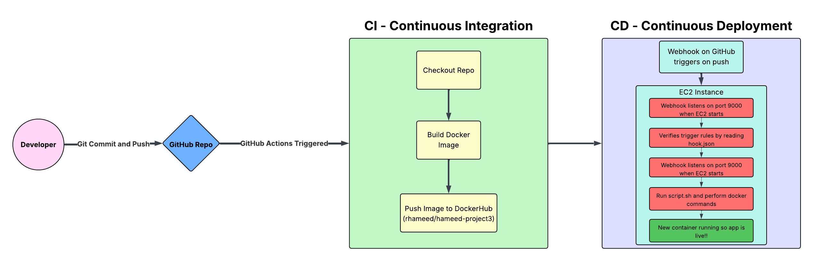
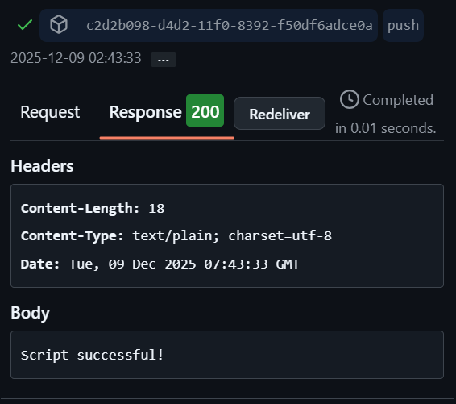
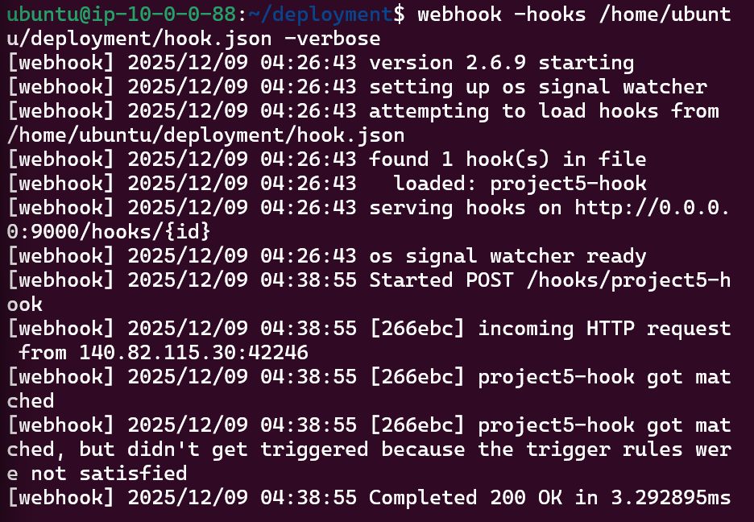
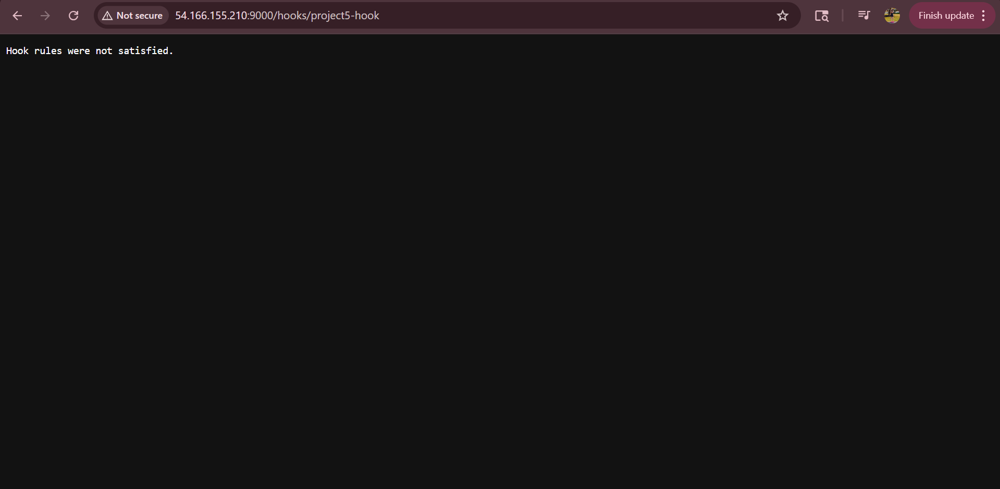

# Project 5 - Continuous Deployment

## Part 4
This project is mostly a *continuation* of Project 4 where we covered continuous integration. The goal of Project 5 is to understand continuous delivery/deployment and be able to connect the two. When changes are pushed to GitHub, EC2 automatically pulls the latest Docker image and restarts the container without having to manually do it yourself. Webhooks make sure that only pushes to the main branch trigger the CD process.

Our EC2 instance, GitHub, adnanh/webhook, bash script, and systemd were used. GitHub holds the repo and therefore everything important, so it triggers webhook when commits are pushed. adnanh/webhook listens on port 9000 for payloads from GitHub. The bash script stops and removes the old container, pulls a new image, and runs a new container. Systemd makes webhook start automatically and keeps it running. 



*Some images have different IPs pictured since they were taken at different times and I had a different IP everytime I SSH-ed*
---

## Part 1
- AMI: Ubuntu with HVM64 = ami-09e67e426f25ce0d7
- The instance is t2.medium, that has 2 CPU cores and 4 GB RAM.
- The recommended volume is 30 GB of storage.
- Security Group: SSH port 22, HTTP port 80, and port 9000 for the webhook.
- The security group only lets in traffic we need, so SSH is for managing the server and HTTP is for dealing with web requests, then it opens up port 9000 for webhook (used 9000 because of the [example](https://willbrowning.me/setting-up-automatic-deployment-and-builds-using-webhooks/) here when I was researching). All other traffic cannot get in so everything is safe.

- To install Docker, run these commands:
```
sudo apt-get update
sudo apt-get install
sudo systemctl enable docker
sudo systemctl start docker
```
- Additional dependencies: I don't think there are any
- To confirm Docker is installed and it can successfully run containers, run the commands:
```
docker --version
docker run hello-world
```
- To pull container image from DockerHub repository, run the command:
```
docker pull rhameed/hameed-project3:latest
```
- To run container from image:
```
docker run -d -p 80:80 --name project5 --restart always rhameed/hameed-project3:latest
```
- The -it flag is for interacting with the container directly and the -d flag is for running the container in the background
- To verify that the container is successful, I went to http://98.94.31.189/ and I saw this page:


- The bash script stops and removes the previously running container, then pulls the latest image, and runs the new container detached.
- How to test / verify that the script successfully performs its taskings
- bash script can be found in Project-5/deployment/script.ssh
- Issue I ran into: when running the script I saw this error (forgot to take a picture):
  ```
  Error response from daemon: No such container: project5 Error response from daemon: No such container: project5 latest: Pulling from rhameed/hameed-project3 Digest: sha256:7e93dc10aef11c48f4984691bb5bdbdc7b2c4961f13bb6aca2280ae6788a5c83 Status: Image is up to date for rhameed/hameed-project3:latest docker.io/rhameed/hameed-project3:latest 982e62361be580c53b7cfc30b9988d3ee36c9e3f04b16f504920cf18dc3952da docker: Error response from daemon: driver failed programming external connectivity on endpoint project5 (61bc37cedae330c5c2aa34063bd8e22f474274d587cf35e5fda08da78ea997ee): Bind for 0.0.0.0:80 failed: port is already allocated.
  ```
This means that port 80 was already being used on the instance. So, I had to run `docker ps` and then manually stop and remove the running container. I guess my script didn't complete **every** task, since I had to manually stop and remove.

---

## Part 2:
- To install adnanh's webhook, use the command;
```
sudo apt-get install webhook
```
- To verify successful installation:
```
webhook -version
```
Mine printed out: webhook version 2.6.9
**Speaking from experience do NOT use webhook version 2.6.9**
- Issues encountered:
  After so long, I realized that 2.6.9 is too old of a version and many people had also complained about not working and faced a similar issue. So I removed the old version and redownloaded it. **This time** the newer version which is 2.8.2. By following the [website](https://github.com/adnanh/webhook?tab=readme-ov-file) directions, I made sure go was installed first then ran `go build github.com/adnanh/webhook`. To verify it was installed you have to run `webhook -version` and then it should show what version you have (2.8.2)!

- The webhook definition file runs the .sh file when there's a push to the main branch. The .json file is what tells the webhook what it needs to do.
- To verify definition file was loaded by webhook, I ran `webhook -hooks /home/ubuntu/cicdf25-Riyamh/Project-5/deployment/hook.json -verbose` and then it outputted something like
```
Dec 09 07:14:33 ip-10-0-0-88 webhook[1774]: [webhook] 2025/12/09 07:14:33 found 1 hook(s) in file
Dec 09 07:14:33 ip-10-0-0-88 webhook[1774]: [webhook] 2025/12/09 07:14:33         loaded: project5-hook
Dec 09 07:14:33 ip-10-0-0-88 webhook[1774]: [webhook] 2025/12/09 07:14:33 serving hooks on http://0.0.0.0:9000/hooks/{id}
```
- To verify webhook is receiving payloads that trigger it, I went into GitHub and created a webhook with this url http://44.204.42.255:9000/hooks/project5-hook (Everytime I logged out of and ended my instance I had to change the IP), set the contet type to application/json, used the same exact secret that's inside of hook.json, enabled SSL verification, triggered just the push events, and added the webhook. Then I went back into my instance and ran `webhook -hooks /home/ubuntu/cicdf25-Riyamh/Project-5/deployment/hook.json -verbose`. I tried pushing commits to GitHub and I finally saw something like:



- The most frustrating issue ever encountered:
  The trigger rules kept failing. The problem was that GitHub was successful in the sense that I could see *successful* logs, but when I was monitoring webhook on my instance it kept saying that the trigger rules weren't satisfied. 
  
  
  
- To monitor logs from running webhook, in my instance I did it using systemd: `sudo vim /etc/systemd/system/webhook.service`. Then, I went off of the examples on this [site](https://medium.com/@benmorel/creating-a-linux-service-with-systemd-611b5c8b91d6) and this [site](https://fedoramagazine.org/systemd-template-unit-files/) to fill out my file.
- What to look for in docker process views: check the containers that are running with `docker ps` and it should should the image name and next to it "Up # minutes". This means that the script was successful!
- Definition file can be found in cicdf25-Riyamh/Project-5/deployment/[hook.json]

- Summary of webhook service file contents
- To enable and start the webhook service:
```
sudo systemctl enable webhook
sudo systemctl start webhook
```
- To verify webhook service is capturing payloads and triggering bash script:
```
sudo systemctl status webhook //to verify it's running
```
Then pushed a commit to GitHub to make sure that the script is running. 
- My service file can be found in cicdf25-Riyamh/Project-5/deployment/[webhook.service]. It was originally made in my instance but i copied it over to my repo. 

---

## Part 3:
- I chose GitHub as the payload sender, since I thought it would easier and more convenient since my repo is set up here and it's literally where all of my files are located. (I also don't like DockerHub as much and find it slightly confusing)
- To enable GitHub to send payloads to the EC2 webhook listener, I went into GitHub and created a webhook with this url http://44.204.42.255:9000/hooks/project5-hook (Everytime I logged out of and ended my instance I had to change the IP), set the content type to application/json, used the same exact secret that's inside of hook.json, enabled SSL verification, triggered just the push events, and added the webhook.
- The trigger that will send a payload to the EC2 webhook listener is when commits are pushed to GitHub. 
- To verify a successful payload delivery, I ran this command `webhook -hooks /home/ubuntu/cicdf25-Riyamh/Project-5/deployment/hook.json -verbose`, then pushed a commit to GitHub and, on my instance, I could see that it says the hook triggered successfully and the .sh file ran. 
- To validate that the webhook only triggers when requests are coming from GitHub, the secrets on GitHub and the .json file **HAVE** to match each other or else the hook will fail. Trigger rules are really strict and if the smallest thing isn't the same, it'll output that hook rules aren't satisfied. 

---

## Resources 
May not be in order!
- LucidChart for my diagram
- Googled so many definitions I couldn't keep track
- (https://docs.aws.amazon.com/AWSCloudFormation/latest/TemplateReference/aws-resource-ec2-instance.html) and (https://octopus.com/blog/aws-cloudformation-ec2-examples): for help with YML file
- (https://docs.docker.com/engine/containers/start-containers-automatically/): for docker command help
- (https://willbrowning.me/setting-up-automatic-deployment-and-builds-using-webhooks/): helped me **a lot** with understanding webhooks and how to build webhooks with GitHub
- (https://github.com/adnanh/webhook/issues/524): scrolled through this thread to see if anyone had a solution for "hook rules not satisfied" only to find that everyone was just as stuck as I was.
- (https://linuxhandbook.com/create-systemd-services/): systemd help (thank you for providing this btw)
- (https://github.com/adnanh/webhook/blob/master/docs/Templates.md): help with writing the .json file
- (https://docs.github.com/en/webhooks/webhook-events-and-payloads): to better understand webhook events
- (https://fedoramagazine.org/systemd-template-unit-files/) and (https://medium.com/@benmorel/creating-a-linux-service-with-systemd-611b5c8b91d6): more systemd help
- (https://github.com/adnanh/webhook): everything I need regarding webhooks
