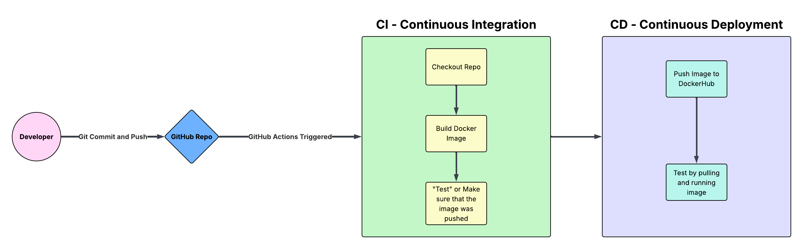
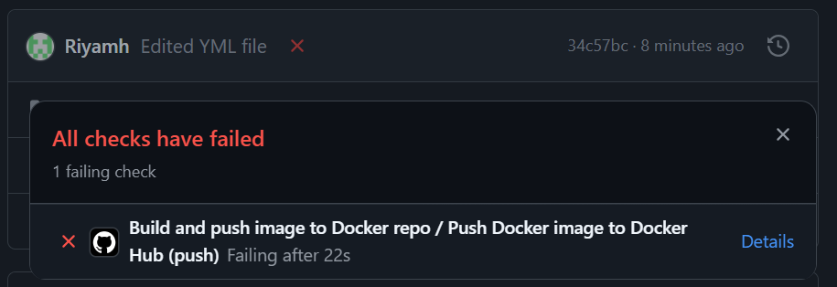
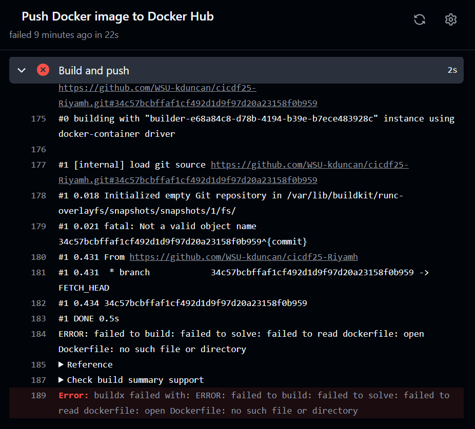
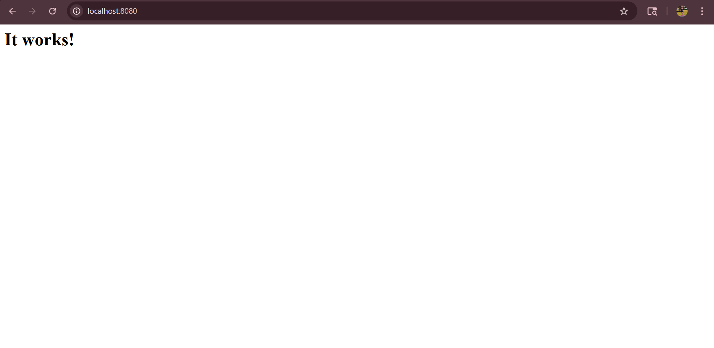
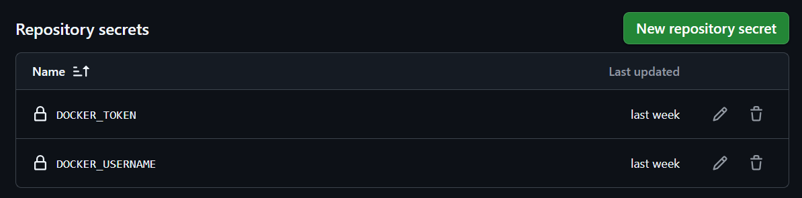

# Project 4 - CI/CD Pipeline
## Part 4
### Project Overview
The goal of this project is to understand how continuous integration and continuous delivery (CI/CD) works. By making changes to the files, GitHub Actions is triggered and a Docker image is made and pushed to the DockerHub. 

In this project, GitHub, GitHub Actions, Docker, and Dockerfile were used. GitHub holds everything needed to trigger GitHub Actions. GitHub Actions is what gets triggered and then creates an image. Dockerfile has the instructions that tell Docker how to build the image. Then, Docker creates and stores the image. 



---

Issues encountered:
1. In GitHub Actions, when pushing I saw this message because my Dockerfile was in the wrong folder:



3. Then, first I did git tag v1.1.1 but nothing happened when I checked my Actions tab in GitHub because I didn't have it set up in the YML file to include tags when pushing. Once I included my tag in the YML, and went back and used git tag v1.1.2, it worked and showed a success in the Actions tab. 

### Resources 
- Lucidchart for my diagram
- From my last project, I reused the same website code in my web-content folder that ChatGPT had generated. My prompt: Create a cute aesthetic two-page HTML/CSS website with an index.html, a second page called stuff.html, and one CSS file. Use soft, pastel, girly colors.

Outputs below:
index.html:
```
<!DOCTYPE html>
<html lang="en">
<head>
    <meta charset="UTF-8">
    <meta name="viewport" content="width=device-width, initial-scale=1.0">
    <title>Welcome - Cute Pastel Site</title>
    <link rel="stylesheet" href="style.css">
</head>
<body>
    <header>
        <h1>🌸 Welcome to My Cute Pastel Site 🌸</h1>
        <nav>
            <a href="index.html">Home</a>
            <a href="stuff.html">Stuff</a>
        </nav>
    </header>
    <main>
        <section>
            <h2>Hello!</h2>
            <p>This is a soft pastel website with a cute aesthetic. Enjoy the calm colors and playful vibe!</p>
            
        </section>
    </main>
</body>
</html>
```
stuff.html:
```
<!DOCTYPE html>
<html lang="en">
<head>
    <meta charset="UTF-8">
    <meta name="viewport" content="width=device-width, initial-scale=1.0">
    <title>Stuff - Cute Pastel Site</title>
    <link rel="stylesheet" href="style.css">
</head>
<body>
    <header>
        <h1>🌸 Stuff Page 🌸</h1>
        <nav>
            <a href="index.html">Home</a>
            <a href="stuff.html">Stuff</a>
        </nav>
    </header>
    <main>
        <section>
            <h2>Fun Stuff!</h2>
            <p>Here’s a little gallery of pastel-inspired items.</p>
            <div class="gallery">
                
                
                
            </div>
        </section>
    </main>
</body>
</html>
```
style.css:
```
/* General Styles */
body {
    font-family: 'Segoe UI', Tahoma, Geneva, Verdana, sans-serif;
    background-color: #FFF0F5; /* lavender blush */
    color: #333;
    margin: 0;
    padding: 0;
}

/* Header */
header {
    background-color: #FFD1DC; /* soft pink */
    padding: 20px;
    text-align: center;
}

header h1 {
    margin: 0;
    font-size: 2em;
}

/* Navigation */
nav a {
    margin: 0 15px;
    text-decoration: none;
    color: #6A5ACD; /* soft purple */
    font-weight: bold;
}

nav a:hover {
    color: #FF69B4; /* hot pink on hover */
}

/* Main Content */
main {
    padding: 20px;
    text-align: center;
}

section h2 {
    color: #FFB6C1; /* light pink */
}

section p {
    font-size: 1.1em;
}

/* Gallery */
.gallery {
    display: flex;
    justify-content: center;
    gap: 15px;
    margin-top: 20px;
}

.gallery img {
    border-radius: 10px;
    box-shadow: 0 4px 6px rgba(0,0,0,0.1);
}

/* Footer */
footer {
    background-color: #FFE4E1; /* misty rose */
    padding: 15px;
    text-align: center;
    margin-top: 20px;
}
```
These HTML and CSS files were **NOT** written by me but by ChatGPT, as stated. 
- https://github.com/marketplace/actions/checkout -> to better understand checkout actions and which version to use
- https://github.com/docker/build-push-action -> to understand how to build and push images with Buildx
- https://github.com/docker/login-action -> for login to DockerHub with GitHub Actions
- https://semver.org/ -> to actually understand semantic versioning because I was confused for a while
- https://docs.github.com/en/actions/reference/workflows-and-actions/workflow-syntax -> workflow syntax help!
- https://docs.github.com/en/actions/reference/workflows-and-actions/events-that-trigger-workflows -> to understand what triggers workflows
- https://github.com/docker/metadata-action -> also really confused but helped with understanding metadata section
- These videos helped me understand the CI/CD pipeline and create my diagram:  
    https://youtu.be/KnSBNd3b0qI?si=Icz3_TW65r0kU-Uu  
    https://youtu.be/M4CXOocovZ4?si=VMyCVM7Za4F89voV  
    https://youtu.be/scEDHsr3APg?si=6f09brOx8wFuYVx7  
    https://youtu.be/jZYrxk2WMbY?si=6B8COc6QuH4R3M0t  

## Part 1
My content can be found in cicdf25-Riyamh/Project-4/[web-content](https://github.com/WSU-kduncan/cicdf25-Riyamh/tree/main/Project-4/web-content). The web-content folder holds all of the files that make up the website, like the HTML and CSS files. Docker needs this folder so that it can display the page. 

Dockerfile can be found in cicdf25-Riyamh/[Dockerfile](https://github.com/WSU-kduncan/cicdf25-Riyamh/blob/main/Dockerfile). Dockerfile has the instructions that build the image.  

To build an image from Dockerfile you have to run the command 
```docker build -t rhameed/hameed-project3:Project4```
When tagging, you have to include your DockerHub username and repo, so that the image can be pushed to DockerHub. 

To run the container, you have to run the command
```docker run -p 8080:8080 rhameed/hameed-project3:Project4```
Then go to [localhost:8080](http://localhost:8080) and you see this page:


## Part 2 - GitHub Actions and DockerHub
The PAT can be created in the DockerHub settings and the recommended scope is read and write so that you can pull and push images. 

To set up repo Secrets, you have to go to your GitHub repo and then click settings-> Secrets and variables -> Actions. Then click to create a new repo Secret and then set the name and Secret.  
 
For this project, the Secrets I set are DOCKER_USERNAME, which is my Docker user, and DOCKER_TOKEN, which is the DockerHub PAT.  


---

What triggers the workflow is when there's a commit to the main branch 
First, the workflow checks out the repo, then sets up Buildx, logs into DockerHub, and then builds and pushes the image with the tag: Project4 (or latest). 

When used in a different repository, make sure to change these: 
1. DockerHub repo name
2. DockerHub username
3. Use your own secrets and your own PAT.
4. Change tags/branch name

The Workflow file can be found in cicdf25-Riyamh/.github/workflows/[docker-workflows.yml](https://github.com/WSU-kduncan/cicdf25-Riyamh/blob/main/.github/workflows/docker-workflows.yml)

---

To make sure that workflow did its job you have to go to your GitHub repo and click on "Actions". Watch it update its status to success, and this means that the workflow was a success!

To verify on DockerHub, you have to pull the image first using the command ```docker pull rhameed/hameed-project3:Project4```
Then run, ```docker run -p 8080:8080 rhameed/hameed-project3:Project4```, and go to [localhost:8080](http://localhost:8080). 

DockerHub repo found in:  (https://hub.docker.com/repository/docker/rhameed/hameed-project3/general)

## Part 3
To see that tags you have in your Git repository, use the command ```git tag```
To make a new tag, use the command ```git tag v1.3.0```
To push a tag to GitHub, use the command ```git tag origin v1.3.0```

---

What triggers the workflow is when a Git tag is pushed (Honorable Mention: Semantic Versioning-> v1.1.2, v1.2.0, v1.3.0, etc)
First, the workflow checks out the repo, then sets up Buildx, logs into DockerHub, reads the metadata, then builds and pushes the image with the tags.

When used in a different repository, make sure to change these: 
1. DockerHub repo name
2. DockerHub username
3. Use your own secrets and your own PAT.
4. Change tags

The Workflow file can be found in cicdf25-Riyamh/.github/workflows/[docker-workflows.yml](https://github.com/WSU-kduncan/cicdf25-Riyamh/blob/main/.github/workflows/docker-workflows.yml)

---

To make sure that workflow did its job you have to go to your GitHub repo and click on "Actions". Watch it update its status to success, and then it'll show the tag next to it. This means that the workflow was a success!

To verify on DockerHub, you have to pull the image first using the command ```docker pull rhameed/hameed-project3:1.3.0```
Then run, ```docker run -p 8080:8080 rhameed/hameed-project3:1.3.0```, and go to [localhost:8080](http://localhost:8080). 
Link to DockerHub repo: https://hub.docker.com/repository/docker/rhameed/hameed-project3/general
